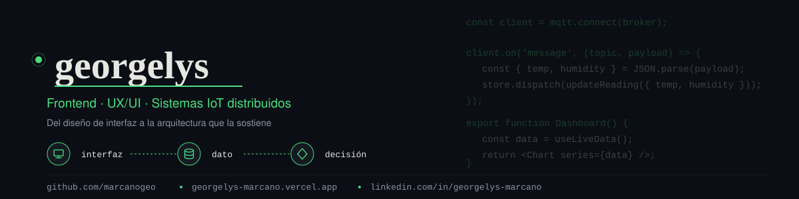

  

<!--# 👩‍💻 Georgelys Marcano-->

# Hola, soy Georgelys 👋

### Frontend · UX/UI · Connected Systems

Diseño interfaces claras y construyo la tecnología que las hace funcionar.

)
)

---

Desarrolladora Frontend y diseñadora UX/UI, especializada en crear interfaces web modernas, accesibles y centradas en las personas. Mi trabajo se extiende hacia sistemas conectados e IoT, integrando interfaces, dispositivos, datos y visualización en soluciones completas.
Actualmente desarrollo una plataforma IoT de monitorización ambiental en tiempo real como parte de mi Máster en Software y Sistemas, combinando ESP32, MQTT, Node-RED, bases de datos y visualización de datos. Soy además miembro fundadora de DevelRoot.
Me interesa especialmente la tecnología que conecta capas: de la interfaz al dato y del dato a la decisión, y los proyectos donde diseño, software y sistemas convergen para resolver problemas reales.

---

## 🚀 Experiencia

- **Coordinadora de Programas Virtuales y Desarrolladora Web**  
  _Universidad de Margarita_ (2020-2022)  
  Lideré el desarrollo fullstack y la implementación del portal web institucional, utilizando HTML5, CSS3, JavaScript, MySQL y Laravel. Mejoré la arquitectura de la información y optimicé el rendimiento en un 30% promedio.

- **Programadora Web**  
  _Leiros S.A, Venezuela_ (2018-2020)  
  Desarrollo de módulos web, integración de bases de datos relacionales, optimización de consultas y mejora de la eficiencia general del sistema.

- **Desarrolladora Web**  
  _ItDriver, Venezuela_ (2018)  
  Desarrollo de interfaces interactivas, conexión con APIs y mejora de la experiencia del usuario final en plataformas web.

---

## 🛠️ Tecnologías y Herramientas

- **Lenguajes y Frameworks:**  
  HTML5, CSS3, JavaScript (ES6+), PHP, Python, Laravel, Vue.js, Astro.js, Bootstrap, Next.js, React (Fundamentos), Livewire
- **Bases de datos:**  
  MySQL, MongoDB (NoSQL)
- **Versionado:**  
  Git, GitHub, GitLab
- **Herramientas:**  
  Figma, Bootstrap Studio, Adobe InDesign, Visual Studio Code, JetBrains (PhpStorm, WebStorm, IntelliJ IDEA, PyCharm), Linux, OpenCart, WordPress, Docker
- **Metodologías:**  
  Scrum, Kanban, XP (Extreme Programming), UML

---
  
## 🌟 Proyectos Destacados

- **Portal Web Institucional - Universidad de Margarita**  
  [Repositorio](https://github.com/marcanog/webunimar)  
  Diseño y desarrollo del portal web institucional, optimizando la navegación y la escalabilidad del proyecto.

- **E-commerce - Guuao**  
  [Sitio Web](https://guuao.com/)  
  Desarrollo de e-commerce utilizando tecnologías modernas y optimización de carritos y experiencia de compra.

- **Sistema Experto para Diagnóstico de Asma en Niños Menores de 5 Años**  
  Implementación de un sistema experto en Visual Basic .Net, facilitando diagnósticos médicos con base de conocimiento.

---

## 🎓 Certificaciones

- IA generativa (Oct 2025)
- Administración avanzada de MS 365 (Sep 2025)
- Azure Developer Jr. (Jul 2025)
- Marketing Digital y Posicionamiento Web (Jun 2025)
- HTML, CSS, PHP Courses (SoloLearn, 2019)
- NDG Linux Unhatched (Cisco, 2018)
- Gestión de Proyectos (LinkedIn, 2020)

---

## 📫 Contacto

<!-- - **Email:** georgelysmarcanob@gmail.com-->
- **Web:** [georgelys-marcano](https://georgelys-marcano.vercel.app/)
- **LinkedIn:** [linkedin.com/in/georgelys-marcano](https://www.linkedin.com/in/georgelys-marcano/)
- **GitHub:** [@marcanogeo](https://github.com/marcanogeo)
  

)
)

---

## License

[MIT](https://choosealicense.com/licenses/mit/)
[CC Licenses](https://https://creativecommons.org/cc-licenses/)

## Badges

Add badges from somewhere like: [shields.io](https://shields.io/)

> _"Siempre motivada por el aprendizaje constante y la creación de soluciones digitales que impacten positivamente a los usuarios."_

 [images/bannerGithub.png]: images/bannerGithub.png
