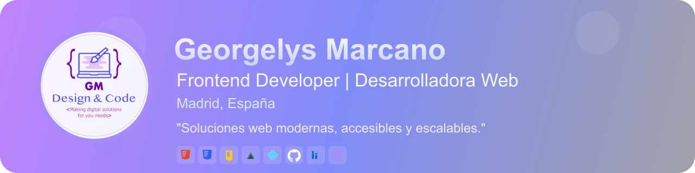

<!--# 👩‍💻 Georgelys Marcano-->

## 👋 ¡Hola! Soy Georgelys Marcano

Apasionada desarrolladora frontend con sólida experiencia en el desarrollo de soluciones web modernas, motivada, creativa y orientada al detalle. Miembro fundador de DevelRoot. Mi enfoque es construir productos digitales escalables y accesibles que mejoren la experiencia de usuario. Me encanta aprender nuevas tecnologías y colaborar en equipos multidisciplinarios.

---

## 🚀 Experiencia

- **Coordinadora de Programas Virtuales y Desarrolladora Web**  
  _Universidad de Margarita_ (2020-2022)  
  Lideré el desarrollo fullstack y la implementación del portal web institucional, utilizando HTML5, CSS3, JavaScript, MySQL y Laravel. Mejoré la arquitectura de la información y optimicé el rendimiento en un 30% promedio.

- **Programadora Web**  
  _Leiros S.A, Venezuela_ (2018-2020)  
  Desarrollo de módulos web, integración de bases de datos relacionales, optimización de consultas y mejora de la eficiencia general del sistema.

- **Desarrolladora Web**  
  _ItDriver, Venezuela_ (2018)  
  Desarrollo de interfaces interactivas, conexión con APIs y mejora de la experiencia del usuario final en plataformas web.

---

## 🛠️ Tecnologías y Herramientas

- **Lenguajes y Frameworks:**  
  HTML5, CSS3, JavaScript (ES6+), PHP, Python, Laravel, Vue.js, Astro.js, Bootstrap, Next.js, React (Fundamentos), Livewire
- **Bases de datos:**  
  MySQL, MongoDB (NoSQL)
- **Versionado:**  
  Git, GitHub, GitLab
- **Herramientas:**  
  Figma, Bootstrap Studio, Adobe InDesign, Visual Studio Code, JetBrains (PhpStorm, WebStorm, IntelliJ IDEA, PyCharm), Linux, OpenCart, WordPress, Docker
- **Metodologías:**  
  Scrum, Kanban, XP (Extreme Programming), UML

---
  
## 🌟 Proyectos Destacados

- **Portal Web Institucional - Universidad de Margarita**  
  [Repositorio](https://github.com/marcanog/webunimar)  
  Diseño y desarrollo del portal web institucional, optimizando la navegación y la escalabilidad del proyecto.

- **E-commerce - Guuao**  
  [Sitio Web](https://guuao.com/)  
  Desarrollo de e-commerce utilizando tecnologías modernas y optimización de carritos y experiencia de compra.

- **Sistema Experto para Diagnóstico de Asma en Niños Menores de 5 Años**  
  Implementación de un sistema experto en Visual Basic .Net, facilitando diagnósticos médicos con base de conocimiento.

---

## 🎓 Certificaciones

- Administración avanzada de MS 365 (en curso)
- Azure Developer Jr. (2025)
- Marketing Digital y Posicionamiento Web (2025)
- HTML, CSS, PHP Courses (SoloLearn, 2019)
- NDG Linux Unhatched (Cisco, 2018)
- Gestión de Proyectos (LinkedIn, 2020)

---

## 📫 Contacto

<!-- - **Email:** georgelysmarcanob@gmail.com-->
- **Web:** [www.georgelysmarcano.com](https://portgeorgelysmarcano.jimdofree.com/)
- **LinkedIn:** [linkedin.com/in/georgelys-marcano](https://www.linkedin.com/in/georgelys-marcano/)
- **GitHub:** [@marcanogeo](https://github.com/marcanogeo)
  

)
)

---

## License

[MIT](https://choosealicense.com/licenses/mit/)

## Badges

Add badges from somewhere like: [shields.io](https://shields.io/)

> _"Siempre motivada por el aprendizaje constante y la creación de soluciones digitales que impacten positivamente a los usuarios."_

 [images/bannerGithub.png]: images/bannerGithub.png
